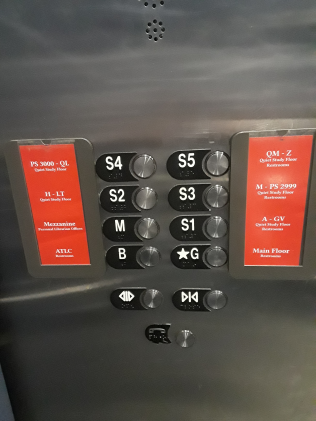
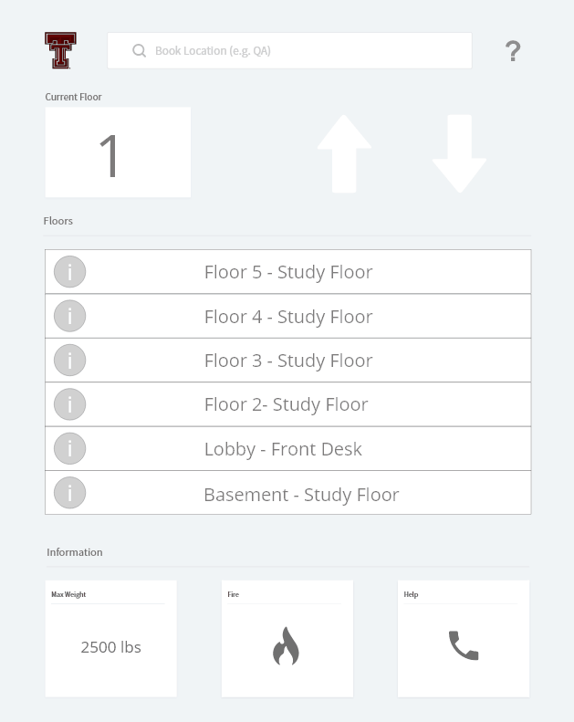

# Elevator interface

## To get a C:

The current interface is not good because:

* It is difficult to tell the differences between S1, S2, ..., S5
* You don't know what S in S* means
* Difficult to find which floor a book is on
* The interface does not show whether the elevator is functioning in the event of fire

## To get a B:

* Common uses:
  * Figure out which floor you need to go to (e.g. finding location of a book) (Not easy)
  * Find the button that will take you to the floor you need to go to (Easy)
  * Pressing the fire button in case of an emergency (Not easy)
  * Open/close the door of the elevator (Easy)
  
* Common sequence of actions:
  1. Figure out which floor you need to go to
  2. Find the button that will take you to that floor
  3. Press the button
  4. Hold the open/close button
  5. Wait until your floor number is shown indicating that you reached your floor

* The elevator helps the user figure out how it works by assigning labels next to the buttons that describe the floors (but not in detail). Additionally, it provides blind people with braille so that they can use the elevator too.

* The elevator provides feedback by:
  * Showing a red light when a button is pressed
  * Beeping when a floor is reached

* Common mistakes with the design:
  * The use of unknown labelling (e.g. S1, S2) and not explaining what "S" is
  * Not providing more information so the user can figure out which floor to go to
  * No emergency button, only one for calling in for assistance
  * No option to deselect a floor so you cannot undo a mistake

## Redesign

## Credits
Michael Kiros
